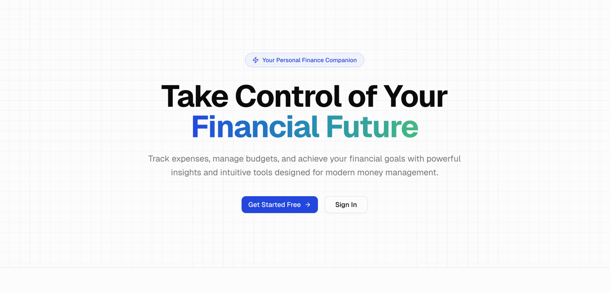
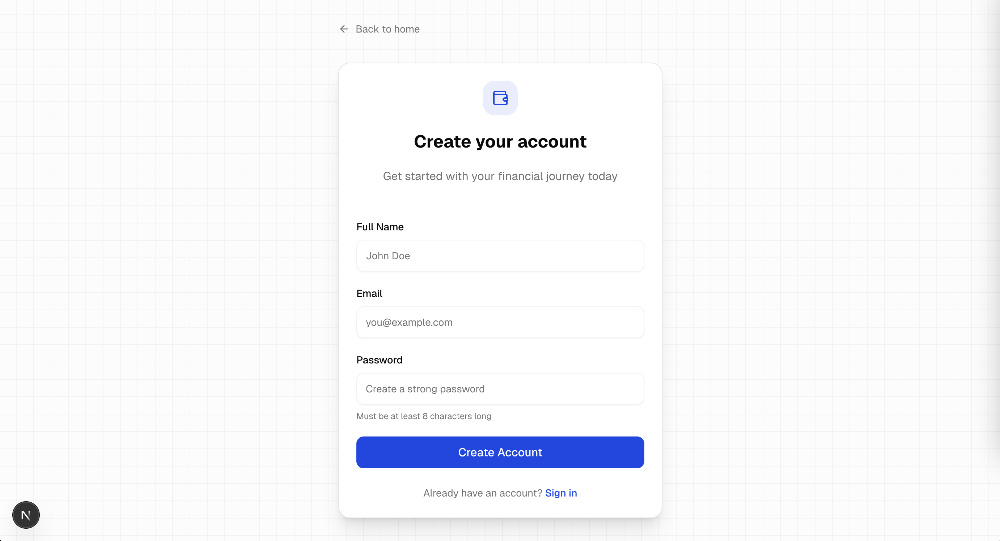
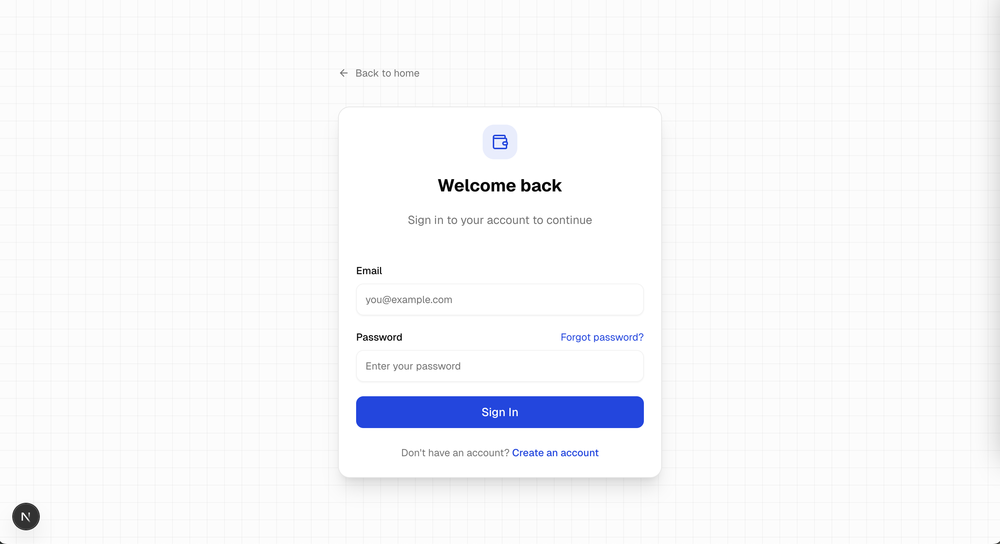
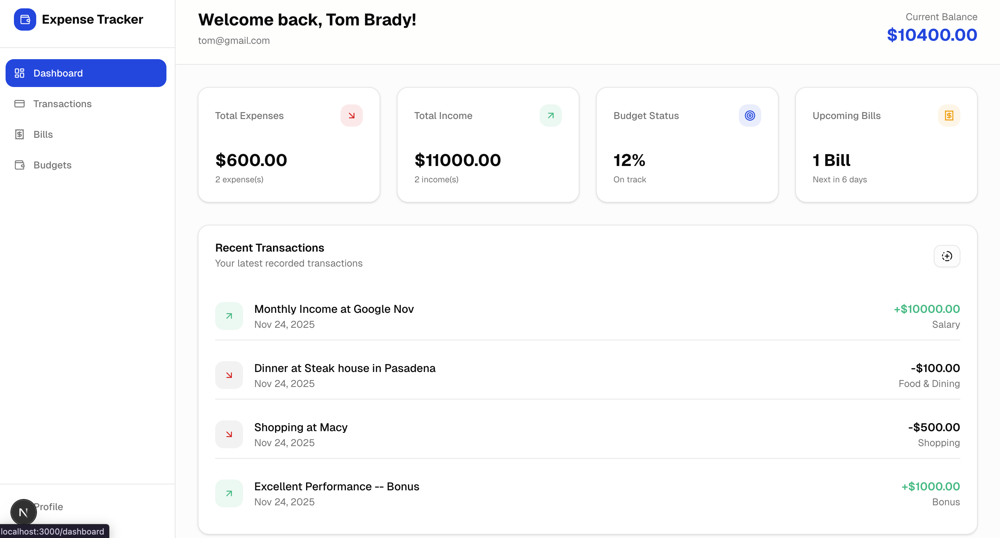
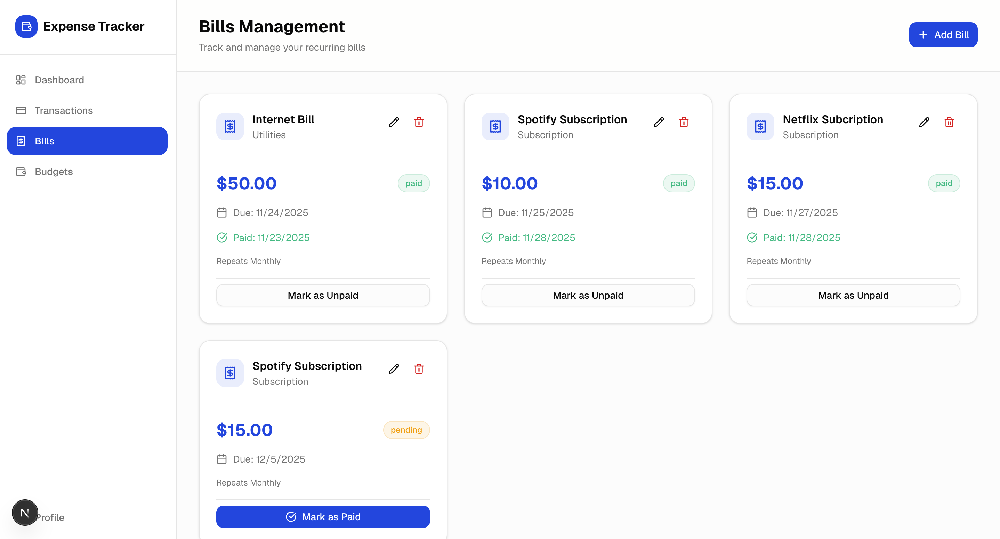
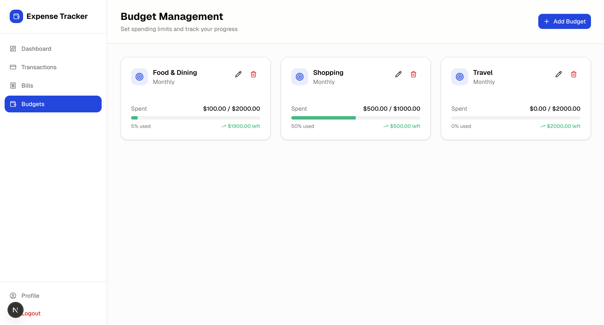
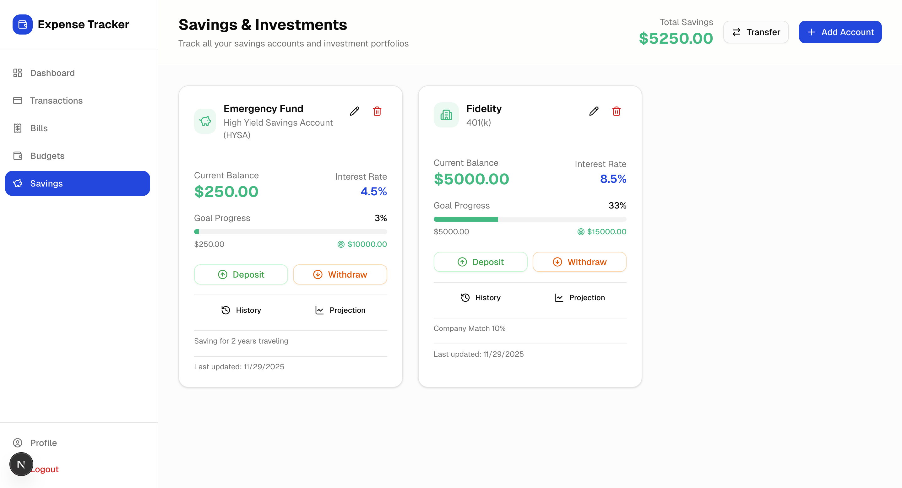
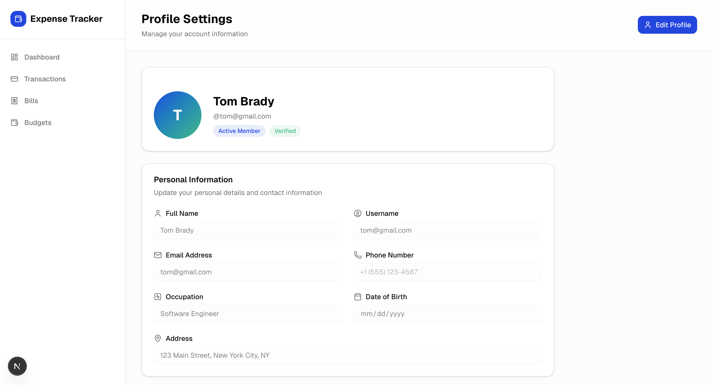

# Expense Tracker Application

## Introduction

This is a full-stack expense tracker application engineered to provide users with a comprehensive and intuitive platform for managing their personal finances. The application is architected with a modern technology stack, featuring a React-based frontend and a robust Java-based backend.

## Features

*   **Transaction Management:** Functionality for creating, reading, updating, and deleting (CRUD) expense records.
*   **Budgeting System:** Allows users to establish and monitor budgets for various spending categories, providing real-time feedback on their financial status.
*   **Financial Dashboard:** A centralized and interactive dashboard that offers a holistic view of the user's financial landscape, including spending patterns and budget adherence.
*   **User Authentication:** Secure user authentication and authorization implemented using JSON Web Tokens (JWT).

## System Architecture

The application employs a client-server architecture, with a single-page application (SPA) frontend that communicates with a backend server via a RESTful API.

### Frontend

The frontend is a responsive and dynamic single-page application built with **Next.js**, a React framework. It is designed to deliver a seamless user experience across both desktop and mobile platforms.

*   **Core Technologies:**
    *   **React:** A JavaScript library for building user interfaces.
    *   **Next.js:** A React framework for production-grade applications.
    *   **TypeScript:** A statically typed superset of JavaScript.
*   **Key Components:**
    *   **Dashboard:** Provides a comprehensive overview of financial data.
    *   **Transactions:** Facilitates the management of individual expense records.
    *   **Bills:** Enables the tracking and management of recurring payments.
    *   **Budgets:** Allows for the creation and monitoring of spending budgets.
    *   **Profile:** Provides user account management and settings.

### Backend

The backend is a powerful and scalable server-side application developed with the **Spring Boot** framework in Java. It exposes a RESTful API for the frontend to consume and handles all business logic and data persistence.

*   **Core Technologies:**
    *   **Java:** A robust and widely-used programming language.
    *   **Spring Boot:** A framework for creating stand-alone, production-grade Spring-based applications.
    *   **Spring Security:** Provides authentication and authorization services.
    *   **JPA (Java Persistence API):** A specification for managing relational data in Java applications.
*   **Architectural Components:**
    *   **Controllers:** Handle incoming HTTP requests, delegate business logic to services, and formulate HTTP responses.
    *   **Services:** Encapsulate the core business logic of the application.
    *   **Repositories:** Mediate between the application and the database, providing an abstraction layer for data access.
    *   **Security:** Implements JWT-based authentication and authorization to secure the API endpoints.

## API Endpoints

The backend exposes a comprehensive set of RESTful API endpoints for managing application resources. The primary endpoints include:

*   `POST /api/auth/signup`: Register a new user.
*   `POST /api/auth/login`: Authenticate a user and receive a JWT.
*   `GET /api/transactions`: Retrieve a list of transactions.
*   `POST /api/transactions`: Create a new transaction.
*   `GET /api/budgets`: Retrieve a list of budgets.
*   `POST /api/budgets`: Create a new budget.
*   `GET /api/bills`: Retrieve a list of bills.
*   `POST /api/bills`: Create a new bill.

## Database Schema

The application utilizes a PostgreSQL relational database to persist data. The database schema is designed to be normalized and efficient, with the following core tables:

*   **customers:** Stores user account information.
*   **transactions:** Contains records of individual expenses.
*   **budgets:** Stores budget information for different categories.
*   **bills:** Contains records of recurring bills.

## Getting Started

To get the application up and running locally, follow these steps:

1.  **Clone the repository:**
    ```bash
    git clone https://github.com/TrungVN9/expense-tracker-app.git
    ```
2.  **Navigate to the backend directory and run the application:**
    ```bash
    cd backend
    ./mvnw spring-boot:run
    ```
3.  **Navigate to the frontend directory and install the dependencies:**
    ```bash
    cd ../frontend
    npm install
    ```
4.  **Run the frontend application:**
    ```bash
    npm run dev
    ```

## Walkthrough

### Landing Page

[Financial Overview and Navigation]



### Create an Account

[Create a new user account to start tracking expenses]



### Sign In

[Log in to your account to access your dashboard]



### Dashboard
[Comprehensive financial overview with charts and summaries]


### Bills

[Bill tracking and management -- view pending and paid bills]



### Budgets

[Budget creation and management -- set spending limits for different categories]



### Saving
[Savings account management -- track and manage your savings]

### Profile

[Profile management and settings -- update personal information and preferences]


